# AI Document Processing Pipeline

```mermaid
flowchart LR
  %% Client -> API -> Storage -> DB -> Celery pipeline -> Workers -> Progress -> Frontend

  subgraph CLIENT ["Client / Browser"]
    C["User selects file & clicks Upload<br/>POST /api/v1/content/upload"]
  end

  subgraph BACKEND ["Backend (FastAPI)"]
    API["API: upload_document<br/>Validate request<br/>Upload to S3 (0-50%)<br/>Create Document + ProcessingJob<br/>status=PROCESSING"]

    STORAGE["S3 / MinIO Object Store<br/>via StorageService (boto3)"]

    DB_CREATE["DB: Create Document & ProcessingJob<br/>Commit transaction"]

    TRIGGER["Trigger Celery Pipeline<br/>chain(extract → group(analyze, embed) → finalize)<br/>publish processing_started"]
  end

  subgraph CELERY ["Celery Workers"]

    EXTRACT["extract_text_task<br/>Download file from S3<br/>Extract text (PDF/OCR/DOCX)<br/>Update progress=20"]

    PARALLEL{"Parallel Processing"}

    ANALYZE["analyze_content_task<br/>LLM via LiteLLM<br/>Model fallback support<br/>Create DocumentVersion<br/>Update progress=50"]

    EMBED["generate_embeddings_task<br/>Split text into chunks<br/>Generate embeddings<br/>Create DocumentChunks<br/>Update progress=75"]

    FINALIZE["validate_and_finalize_job_task<br/>Wait for group completion<br/>Validate outputs<br/>Mark COMPLETED or FAILED"]

    RESULT{"Result"}

    SUCCESS["COMPLETED<br/>progress=100"]

    FAIL["FAILED<br/>progress=0"]
  end

  subgraph PROGRESS ["Progress / SSE"]

    BRIDGE["celery_sse_bridge.publish_progress_update<br/>Write progress/stage/status to DB"]

    SSE["SSE Manager / EventSource Endpoint"]

    CLIENT_UI["Frontend Progress Bar / Status<br/>Fallback: Polling Endpoint"]
  end

  subgraph RETRY ["Retries & Failure Handling"]

    RETRIES["Celery Retry Configuration<br/>autoretry_for<br/>retry_backoff<br/>retry_jitter<br/>max_retries"]

    FAIL_HANDLER["_mark_job_failed_on_failure()<br/>Retries exhausted → FAILED"]
  end

  %% Main Flow
  C --> API
  API --> STORAGE
  STORAGE --> DB_CREATE
  DB_CREATE --> TRIGGER

  TRIGGER --> EXTRACT

  EXTRACT --> PARALLEL

  PARALLEL --> ANALYZE
  PARALLEL --> EMBED

  ANALYZE --> FINALIZE
  EMBED --> FINALIZE

  FINALIZE --> RESULT

  RESULT --> SUCCESS
  RESULT --> FAIL

  %% Progress Updates
  EXTRACT --> BRIDGE
  ANALYZE --> BRIDGE
  EMBED --> BRIDGE
  FINALIZE --> BRIDGE

  BRIDGE --> SSE
  SSE --> CLIENT_UI

  %% Retry Notes
  RETRIES -.-> EXTRACT
  RETRIES -.-> ANALYZE
  RETRIES -.-> EMBED
  RETRIES -.-> FINALIZE

  FAIL_HANDLER --> BRIDGE

  %% Documentation Notes
  MODEL_NOTE["LiteLLM provides provider abstraction and model fallback.<br/>Fallback decisions are recorded in job metadata."]
  ANALYZE -.-> MODEL_NOTE

  RETRY_NOTE["Celery manages worker retries, backoff, jitter and failure recovery."]
  RETRIES -.-> RETRY_NOTE
```



## Architecture Summary

1. User uploads a document through the FastAPI endpoint.
2. File is stored in S3/MinIO and metadata is persisted in PostgreSQL.
3. A Celery workflow is triggered using:
   - `chain(extract -> group(analyze, embed) -> finalize)`

4. Text extraction runs first.
5. Analysis and embedding generation execute in parallel.
6. Analysis creates a `DocumentVersion`.
7. Embedding generation creates `DocumentChunks`.
8. Finalization validates all outputs and marks the job as completed or failed.
9. Progress updates are continuously published through the SSE bridge.
10. Frontend receives updates through SSE with polling as a fallback.
11. Celery provides automatic retries, backoff, jitter, and failure handling.

```

```
