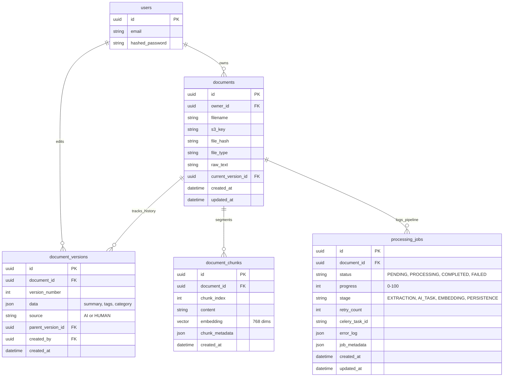
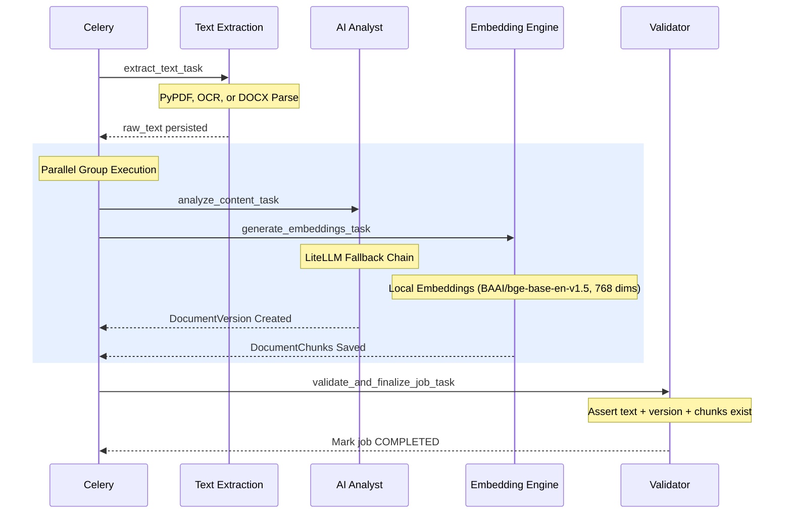
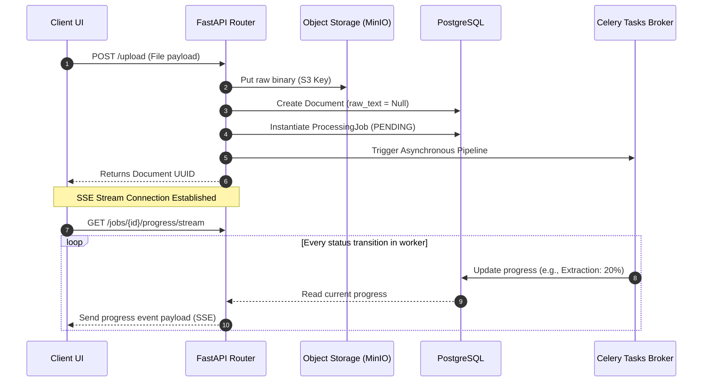
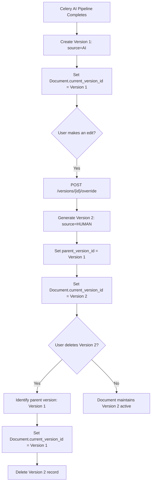

# AI-Powered Content Processing Pipeline (AIPCPP)
## Detailed System Documentation & Architecture Guide

Welcome to the comprehensive architecture and documentation guide for the **AI-Powered Content Processing Pipeline (AIPCPP)**. This system is engineered to ingest raw, multi-format content (PDFs, Images, DOCX, Text), parse the data asynchronously, generate AI summaries and topic classifications, compute high-dimensional vector embeddings, and enable instant semantic search alongside a human-in-the-loop editing timeline.

---

## 1. System Overview

AIPCPP is built using a modern, scalable, and asynchronous Python stack. The core objectives of the system are:
1. **Multi-Format Ingestion**: Ingest and store files (up to 50MB) like text, PDFs, and images (OCR required) securely using S3-compatible storage.
2. **Asynchronous Analysis**: Decouple file uploads from computation by executing text extraction, LLM analysis, and embedding generation in background workers.
3. **Semantic Querying**: Enable intelligent, conceptually driven search across document chunks using vector databases instead of simple keyword matching.
4. **Human-in-the-Loop Override**: Keep a persistent audit trail of edits made to AI-generated details, allowing users to override, update, and rollback summaries or categorization tags.

```
┌──────────────┐     File Ingestion      ┌─────────────────┐     Vector Store
│ Next.js Client│ ─────────────────────> │ FastAPI Backend │ ──────────────────> PostgreSQL
└──────────────┘                         └─────────────────┘                    (pgvector)
       ▲                                          │ Trigger
       │ SSE Real-time Updates                    │ Background Job
       │                                          ▼
┌──────────────────┐                     ┌─────────────────┐                    ┌──────────────┐
│  SSE Connection  │                     │ Celery Workers  │ ─────────────────> │ LiteLLM API  │
└──────────────────┘                     └─────────────────┘      AI Insights   └──────────────┘
```

---

## 2. Technical Stack & Core Abstractions

* **Core Framework**: **FastAPI** (Python 3.12) utilizing asynchronous handlers.
* **Database & ORM**: **PostgreSQL 17** + **pgvector** for vector search, mapped via **SQLModel** (which unifies SQLAlchemy and Pydantic).
* **Asynchronous Task Queue**: **Celery** with **Redis** as a broker for distributed background workers.
* **AI Integration**: **LiteLLM** (supporting a fallback chain between Google Gemini and OpenAI).
* **Text & OCR Engines**: **PyPDF** (PDF extraction) and **Tesseract OCR** (Image parsing).
* **Caching & Performance**: **Redis** caching utilizing custom decorators for caching search and version timeline operations.
* **Storage Layer**: S3-compatible object storage (e.g., **MinIO** or **LocalStack**) to isolate and manage raw uploaded files.

---

## 3. Database Schema & Data Models

The system architecture utilizes 5 primary database tables to map relationships. Below is the entity-relationship layout:



---

## 4. Architectural Layer Pattern

Each capability resides under `app/modules/<domain>/` and follows a strict **Layered Module Pattern** to isolate HTTP boundaries, business logic, data persistence, and models:

1. **Routes Layer (`routes.py`)**: HTTP handlers validating schemas and invoking scoped services. HTTP logic remains strictly in this layer.
2. **Service Layer (`services.py`)**: Core business orchestrator. Scoped services take an active `AsyncSession` to construct repositories. Coordinate operations across repositories.
3. **Repository Layer (`repositories.py`)**: Clean data access abstraction. Focuses entirely on SQL queries and basic persistent operations, using `flush()` for inline actions and leaving transaction commits to the service layer.
4. **Schemas Layer (`schemas.py`)**: Contains plain Pydantic models for request payloads and response shapes, strictly using the `T` prefix (e.g., `TVersionRead`).

---

## 5. Module Breakdown & Processes

### A. The `content` Module
Manages file ingestion, storage interactions, status polling, and pagination.
* **Core Endpoints**:
  * `POST /api/v1/content/upload`: Parses raw files, verifies format constraints, saves the binary data to S3, instantiates a `ProcessingJob`, and triggers the async pipeline.
  * `GET /api/v1/content/summaries`: A fully paginated list handler supporting searching, sorting, and multi-file filtering.
  * `GET /api/v1/content/jobs/{document_id}/progress/stream`: A **Server-Sent Events (SSE)** connection allowing real-time pipeline status updates on the frontend.
* **Text Extraction Engine**:
  * Decodes text formats dynamically.
  * Parses DOCX files from the raw OpenXML schema (`word/document.xml`).
  * Employs PyPDF to scan page elements and Tesseract OCR to perform image text recognition.

---

### B. The `processing` Module
Operates in Celery background workers. It leverages asynchronous stages to process raw document materials without blockages.
* **Celery Workflow Design**:
  * Runs a pipeline sequence configured as a **Celery Chain** containing a **Group** for parallelization:
    `Chain( Extraction ──> Group(AI Analysis, Embedding Generation) ──> Finalize & Validate )`
* **Fallback AI Chains**:
  * Uses **LiteLLM** to invoke `gemini/gemini-2.0-flash`.
  * If a rate limit or service interruption strikes, it intercepts the error and cascades to alternate models (`gemini/gemini-pro-latest` or OpenAI endpoints) to guarantee system resilience.



---

### C. The `search` Module
Orchestrates intelligent semantic retrieval using pgvector.
* **Similarity Search Logic**:
  * Receives a search prompt, generates its corresponding 768-dimensional vector embedding using the local embedding model (`BAAI/bge-base-en-v1.5`), and performs a cosine-distance search.
  * Cosine similarity is computed directly in SQL using the operator `<=>` (cosine distance) and mapped as `1 - distance`.
  * Allows pagination, strict document owner validation, and joins the related `document_versions` table to yield summaries inline.
* **Performance Enhancements**:
  * The search service is cached utilizing a customized Redis decorator (`@cached`) invalidating search queries automatically as document modifications occur.

---

### D. The `versions` Module
Enables a robust human-in-the-loop review architecture. When the AI finishes processing a document, a base version (`version_number = 1`, `source = AI`) is logged.
* **Human Overrides**:
  * When a user modifies summary notes, categories, or keywords via `POST /api/v1/versions/{document_id}/override`, a new version entry is committed (`version_number = 2`, `source = HUMAN`), pointing back to its parent version.
  * The parent pointer enables full timeline navigation.
* **Deletion & Rollbacks**:
  * Deleting a version updates the parent pointer and rolls back `Document.current_version_id` to the preceding version, ensuring chronological continuity without breaking document status.
* **Caching Decorators**:
  * Accelerates retrieving histories using `@cached` and clears old items via `@cache_invalidate` upon creating, editing, or deleting entries.

---

## 6. Detailed Process Flows

### Flow 1: Document Upload & Real-time Progress Tracking
The client requests an ingestion process. To give users a fluid interface, AIPCPP leverages a dual-process connection combining upload APIs and Server-Sent Events:



---

### Flow 2: Human Override Versioning Lifecycle
This flowchart details how the system keeps a linear versioning history of content analysis, preserving the original AI extraction while allowing user modifications:



---

## 7. Resiliency & Performance Measures

AIPCPP is built to survive large loads and external system faults:

| Scenario / Threat | Countermeasure | Implementation details |
|---|---|---|
| **Large Ingestions (PDFs/Images)** | Asynchronous Offloading | Workers execute slow operations (OCR, PDF reading, Vector embeddings) in Celery background threads. |
| **Model Invocations Hanging** | Enforced Deadlines | AI tasks are constrained by strict timeouts (30s for Analysis). |
| **Model Rate Limits / Outages** | Fallback Cascades | LiteLLM cycles through fallback options (Gemini 2.0 -> Gemini Pro -> alternate providers) dynamically. |
| **Network & Connection Blips** | Jittered Backoffs | Celery tasks execute up to 5 retries with exponential backoffs and randomized jitter intervals. |
| **Hot Path Search Queries** | Redis Caching Decorators | Scoped caches for search keys and timelines; instant programmatic invalidate prefixes upon edits. |
| **Large DB Join Overhead** | pgvector Cosine Operators | Computes similarity values natively inside PostgreSQL index space before returning results. |
