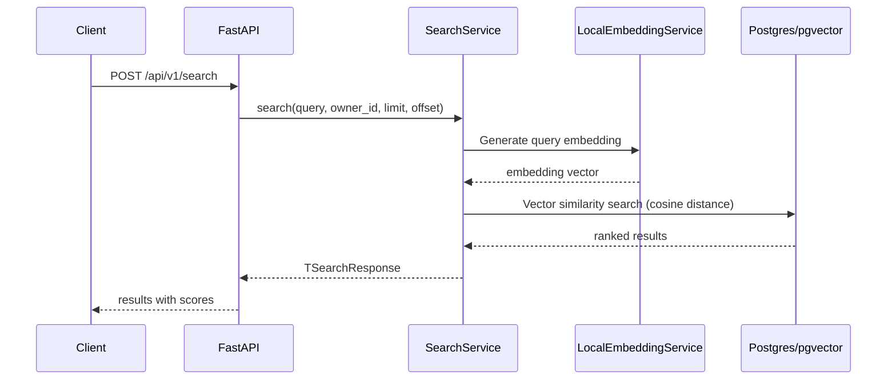

# Semantic Search API

This document describes the semantic search feature that allows users to search across document contents using vector similarity.

## Overview

The search feature uses **semantic similarity** rather than keyword matching. When a user submits a search query:
1. The query text is converted to an embedding vector using the configured local embedding model (sentence-transformers)
2. The vector is compared against stored document chunk embeddings using **cosine similarity**
3. Results are ranked by similarity score and returned with document metadata

## Architecture



## API Endpoint

### POST /api/v1/search

**Request Body:**
```json
{
    "query": "search text here",
    "limit": 10,
    "offset": 0
}
```

**Query Parameters:**
- `owner_id` (optional): Filter results by owner UUID

**Response:**
```json
{
    "results": [
        {
            "document_id": "uuid",
            "filename": "document.pdf",
            "file_type": "PDF",
            "chunk_content": "relevant text chunk...",
            "chunk_index": 0,
            "similarity_score": 0.85,
            "summary": "document summary",
            "created_at": "2026-01-01T00:00:00"
        }
    ],
    "total": 15,
    "query": "search text here",
    "limit": 10,
    "offset": 0
}
```

## Implementation Details

### Files

| File | Purpose |
|------|---------|
| `app/modules/search/routes.py` | FastAPI endpoint definition |
| `app/modules/search/services.py` | Business logic, embedding generation |
| `app/modules/search/repositories.py` | Vector similarity query using pgvector |
| `app/modules/search/schemas.py` | Request/response Pydantic models |
| `app/modules/search/constants.py` | Configuration and error messages |

### Key Components

#### SearchRepository (`repositories.py`)
- Uses pgvector's `cosine_distance` function for similarity search
- Performs vector similarity between query embedding and stored `DocumentChunk.embedding`
- Returns results with similarity scores and document metadata
- Supports filtering by owner_id
- Supports pagination (limit/offset)

#### SearchService (`services.py`)
- Generates query embedding using LocalEmbeddingService
- Validates search parameters (query not empty, limit within bounds)
- Orchestrates the search flow
- Transforms raw results into typed response models

### Configuration

Settings in `app/config/settings.py`:
```python
LOCAL_EMBEDDING_MODEL: str = "BAAI/bge-base-en-v1.5"  # Local embedding model
EMBEDDING_DIMENSION: int = 768  # Vector dimensions (BAAI/bge-base-en-v1.5)
```

## How It Works

### 1. Embedding Generation
The search service uses `LocalEmbeddingService` to generate a 768-dimensional embedding vector locally using the configured model (default: `BAAI/bge-base-en-v1.5`).

### 2. Vector Similarity Search
The repository executes a SQL query using pgvector's `cosine_distance`:
```sql
SELECT document_chunks.*, documents.*, document_versions.*,
       1 - (document_chunks.embedding <=> :query_embedding) as similarity
FROM document_chunks
JOIN documents ON document_chunks.document_id = documents.id
LEFT JOIN document_versions ON documents.current_version_id = document_versions.id
WHERE document_chunks.embedding IS NOT NULL
ORDER BY similarity DESC
LIMIT :limit OFFSET :offset
```

The `<=>` operator in pgvector computes cosine distance. By subtracting from 1, we get cosine similarity.

### 3. Result Ranking
Results are sorted by similarity score in descending order. The similarity score ranges from 0 to 1, where:
- 1.0 = exact match (query embedding identical to stored embedding)
- 0.0 = no similarity

### 4. Response Construction
Each result includes:
- Document metadata (id, filename, file_type, created_at)
- Chunk content and index
- Similarity score
- Associated summary (if available)

## Requirements

For semantic search to work, documents must have:
1. **Processed text**: Document must have gone through the pipeline (extraction stage)
2. **Generated embeddings**: Pipeline must have completed the embedding stage
3. **Stored chunks**: DocumentChunk records with non-null embedding vectors

If a document hasn't been processed, it won't appear in search results.

## Error Handling

| Error | Cause | HTTP Status |
|-------|-------|--------------|
| Empty query | Query string is empty or whitespace | 422 (Pydantic validation) |
| Invalid limit | Limit < 1 or > 100 | 422 (Pydantic validation) |
| Embedding failed | Local inference error | 500 |

## Limitations

1. **Model loading**: First use of `LocalEmbeddingService` dynamically loads the model into memory. Subsequent calls perform fast in-memory inference.
2. **Model dependency**: Search quality depends on the embedding model's capabilities
3. **Chunk-level results**: Returns matching chunks, not complete documents (may return multiple chunks from same document)
4. **Owner filtering**: Only searches documents owned by the current user (or specified owner)