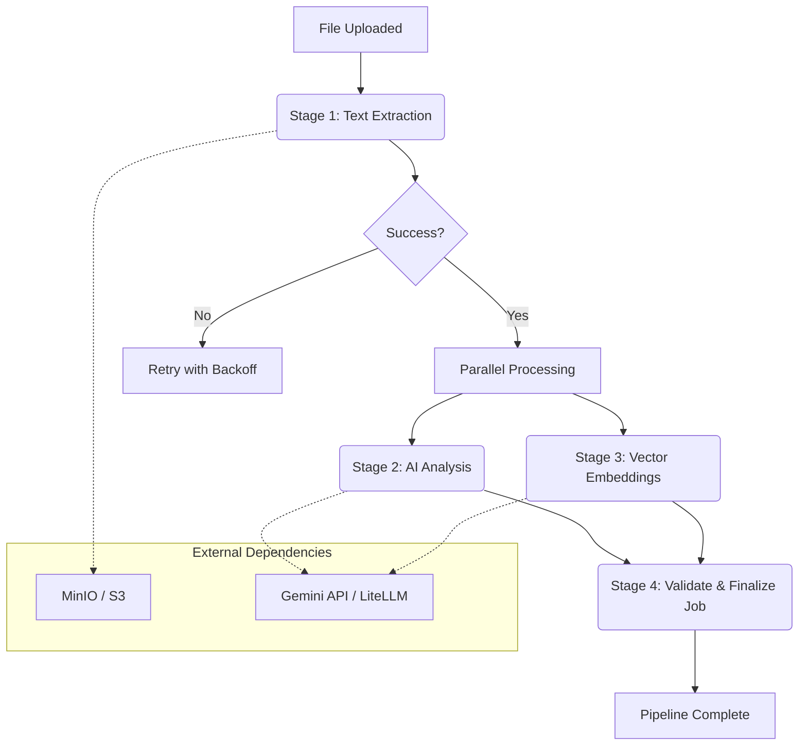

# Document Processing & Summary Generation Pipeline

This document details the background processing pipeline responsible for transforming uploaded files into AI-powered insights, including text extraction, summary generation, and vector embeddings.

## Pipeline Architecture

The pipeline uses a **Celery Workflow** (**chain** + **group** + a final validation step), optimizing execution by running independent stages in parallel while only marking the job as completed after all parallel work finishes.



---

## Processing Stages

### 1. Text Extraction (`extract_text_task`)

- **Responsibility**: Retrieves the raw file from S3/MinIO and extracts human-readable text.
- **Supported Formats**:
  - **PDF**: Uses `pypdf`.
  - **Images**: Uses `Tesseract OCR`.
  - **Text**: Direct reading.
  - **DOCX**: Extracts from Office OpenXML (`word/document.xml`).
- **Output**: Updates `Document.raw_text` and advances the `ProcessingJob` stage.

### 2. AI Analysis (`analyze_content_task`)

- **Responsibility**: Orchestrates AI models to generate structured summaries and metadata.
- **Logic**:
  - **Summarization**: Generates a concise summary of the extracted text.
  - **Tagging**: Extracts relevant keywords and topics.
  - **Categorization**: Classifies the document (e.g., Invoice, Report, Letter).
- **Resiliency**:
  - Uses **Exponential Backoff** for rate limits.
  - Implements **Model Fallback**: If Gemini-Pro fails, it retries with secondary providers via LiteLLM.
- **Output**: Creates a new `DocumentVersion` and updates `Document.current_version_id`.

### 3. Vector Embeddings (`generate_embeddings_task`)

- **Responsibility**: Converts the extracted text into high-dimensional vectors for semantic search.
- **Dimensions**: 3072 (optimized for Gemini-2).
- **Output**: Populates the `document_chunks` table with `pgvector` compatible embeddings.

### 4. Validate & Finalize (`validate_and_finalize_job_task`)

- **Responsibility**: Synchronization point that runs after the parallel stage.
- **Validation**:
  - `Document.raw_text` exists (extraction succeeded)
  - `Document.current_version_id` exists and points to a `DocumentVersion` with summary data (analysis succeeded)
  - At least one `DocumentChunk` exists (embeddings succeeded)
- **Output**: Marks `ProcessingJob` as **COMPLETED** only after all validations pass.

---

## Resiliency & Fault Tolerance

| Feature             | Implementation                                                                                                       |
| :------------------ | :------------------------------------------------------------------------------------------------------------------- |
| **Retries**         | 5 retries per task with randomized jitter to prevent "thundering herd" issues.                                       |
| **Backoff**         | Exponential increase in wait time (up to 15 minutes for Analysis).                                                   |
| **Timeouts**        | Strict timeouts (30s for Analysis, 20s for Embeddings) to prevent hanging workers.                                   |
| **Status Tracking** | Job is marked **COMPLETED** by the finalizer once all outputs exist; intermediate stages update `stage` as they run. |

## Error Handling

### Validation Failure

If the finalizer validation fails:

1.  The `ProcessingJob` is marked as **FAILED**.
2.  The error is logged with context (document ID).

### Parallel Task Failure

The pipeline uses a **chain** with a **group** for parallel execution:

```python
processing_pipeline = chain(
    extract_text_task.s(str(document_id)),
    group(analyze_content_task.s(), generate_embeddings_task.s()),
    validate_and_finalize_job_task.s(),
)
```

If either `analyze_content_task` or `generate_embeddings_task` fails after exhausting all retries (5 attempts with exponential backoff), the `on_failure` callback marks the job as **FAILED**:

- **Callback**: `_mark_job_failed_on_failure` in `app/modules/processing/tasks.py`
- **Trigger**: Only executes when `task.request.retries >= task.max_retries`
- **Behavior**:
  1. Checks that job is not already `COMPLETED` (handles race condition where task retried and succeeded)
  2. Updates `ProcessingJob.status` to `FAILED`
  3. Updates `ProcessingJob.stage` to `PERSISTENCE`
  4. Commits the change

This prevents jobs from getting stuck in `PENDING` state when parallel tasks fail after all retries.
