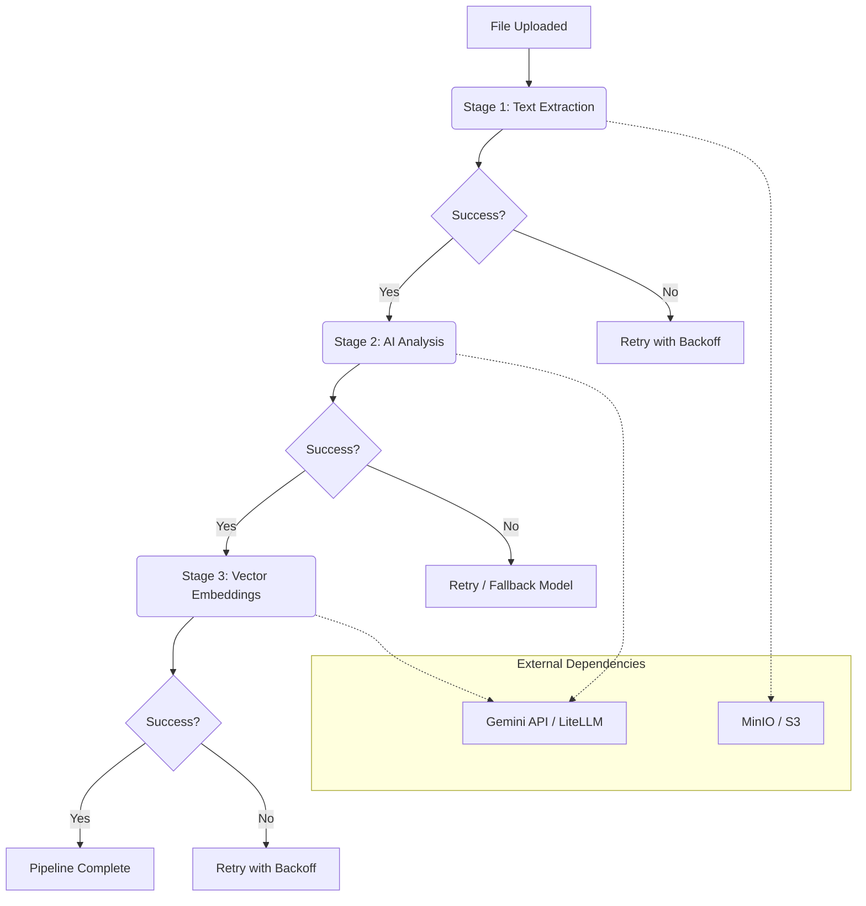

# Document Processing & Summary Generation Pipeline

This document details the background processing pipeline responsible for transforming uploaded files into AI-powered insights, including text extraction, summary generation, and vector embeddings.

## Pipeline Architecture

The pipeline is implemented as a **Celery Chain**, ensuring a sequential and reliable execution flow. Each stage depends on the successful completion of the previous one.

---

## Processing Stages

### 1. Text Extraction (`extract_text_task`)
*   **Responsibility**: Retrieves the raw file from S3/MinIO and extracts human-readable text.
*   **Supported Formats**: 
    *   **PDF**: Uses `PyMuPDF` / `pdfplumber`.
    *   **Images**: Uses `Tesseract OCR` or Vision Models.
    *   **Text**: Direct reading.
*   **Output**: Updates `Document.raw_text` and advances the `ProcessingJob` stage.

### 2. AI Analysis (`analyze_content_task`)
*   **Responsibility**: Orchestrates AI models to generate structured summaries and metadata.
*   **Logic**:
    *   **Summarization**: Generates a concise summary of the extracted text.
    *   **Tagging**: Extracts relevant keywords and topics.
    *   **Categorization**: Classifies the document (e.g., Invoice, Report, Letter).
*   **Resiliency**: 
    *   Uses **Exponential Backoff** for rate limits.
    *   Implements **Model Fallback**: If Gemini-Pro fails, it retries with secondary providers via LiteLLM.
*   **Output**: Creates a new `DocumentVersion` and updates `Document.current_version_id`.

### 3. Vector Embeddings (`generate_embeddings_task`)
*   **Responsibility**: Converts the extracted text into high-dimensional vectors for semantic search.
*   **Dimensions**: 3072 (optimized for Gemini-2).
*   **Output**: Populates the `document_chunks` table with `pgvector` compatible embeddings.

---

## Resiliency & Fault Tolerance

| Feature | Implementation |
| :--- | :--- |
| **Retries** | 5 retries per task with randomized jitter to prevent "thundering herd" issues. |
| **Backoff** | Exponential increase in wait time (up to 15 minutes for Analysis). |
| **Timeouts** | Strict timeouts (30s for Analysis, 20s for Embeddings) to prevent hanging workers. |
| **Status Tracking** | Real-time updates to `ProcessingJob` (PENDING -> PROCESSING -> COMPLETED/FAILED). |

## Error Handling

If a task exceeds its maximum retries:
1.  The `ProcessingJob` is marked as **FAILED**.
2.  The error is logged with the full traceback and context (document ID).
3.  Circular dependencies (e.g., between Document and Version) are managed via `ON DELETE SET NULL` to ensure clean state even during partial failures.
