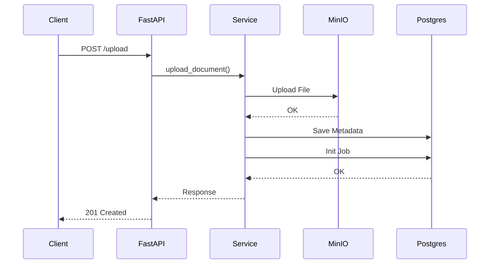

# File Upload API: Implementation Walkthrough & Trade-offs

This document provides a deep dive into how the File Upload API is structured in the AI-Powered Content Processing Pipeline.

## 1. API Architecture Breakdown

The upload process follows a strict layered architecture to ensure separation of concerns:

### Core Components:

- **`app/modules/content/routes.py`**: Handles the HTTP contract. It uses `UploadFile` which streams the file to memory/spool, preventing RAM spikes for large files.
- **`app/modules/content/services.py`**: The "Orchestrator." It doesn't know _how_ S3 works or _how_ the DB saves; it just directs the flow.
- **`app/common/storage.py`**: A thin wrapper around `boto3`. It abstracts away the bucket creation and credential handling.

---

## 2. Implementation Decisions & Trade-offs

### A. The "Sync-in-Async" Challenge

**Decision**: Use `run_in_threadpool` for S3 uploads.

- **Why?**: The official AWS SDK (`boto3`) is synchronous. In a FastAPI `async def` function, a large upload would block the entire server's thread, stopping other users.
- **Trade-off**: Managing thread pools adds a small amount of overhead, but it is the standard "safe" way to use stable libraries like `boto3` in an async environment.

### B. Decoupling Content from Processing

**Decision**: Create a `Document` record AND a `ProcessingJob` record simultaneously.

- **Why?**: This allows the API to return immediately while the actual AI processing happens in the background.
- **Trade-off**: Requires more complex state management (checking job status later), but provides a much better User Experience (UX) as the user doesn't wait for AI to finish.

---

## 3. MinIO vs. Database Storage (Trade-offs)

In this project, we chose **MinIO (S3-compatible Object Storage)** over storing files as `BYTEA` or `BLOB` in Postgres.

| Feature         | MinIO / S3 (Chosen)                                           | Database (BYTEA)                                            |
| :-------------- | :------------------------------------------------------------ | :---------------------------------------------------------- |
| **Performance** | High. Offloads heavy binary data from DB engine.              | Low. Bloat makes DB backups and queries slower.             |
| **Scalability** | Unlimited. Can scale storage independently of the app.        | Limited by the DB's storage and memory limits.              |
| **Cost**        | Cheap. S3-compatible storage is very cost-effective.          | Expensive. High-performance DB storage is pricey.           |
| **Consistency** | **Weak**. If DB fails after upload, a file is orphaned in S3. | **Strong**. File and metadata are saved in one transaction. |
| **Portability** | High. Can switch to AWS, GCS, or R2 easily.                   | Low. Locked into the specific DB engine.                    |

### The "Orphaned File" Problem

One major trade-off of using S3 is that we don't have atomic transactions across S3 and Postgres.

- **The Risk**: If the file uploads to MinIO but the database insert fails (e.g., a connection error), we have a file in MinIO with no database record.
- **Our Strategy**: We perform the upload _before_ the DB insert. This ensures we never have a DB record pointing to a non-existent file. We can later implement a background "garbage collector" task to delete files in S3 that don't have matching DB records.

---

## 4. Why Postgres 17 + pgvector?

Even though the file lives in MinIO, we need Postgres for:

1. **Metadata**: Tracking filename, owner, and status.
2. **Semantic Search**: Once the file is processed, we extract text and store **Vector Embeddings** in Postgres using `pgvector`. This allows the "AI" to search through your documents by "meaning" rather than just keywords.
